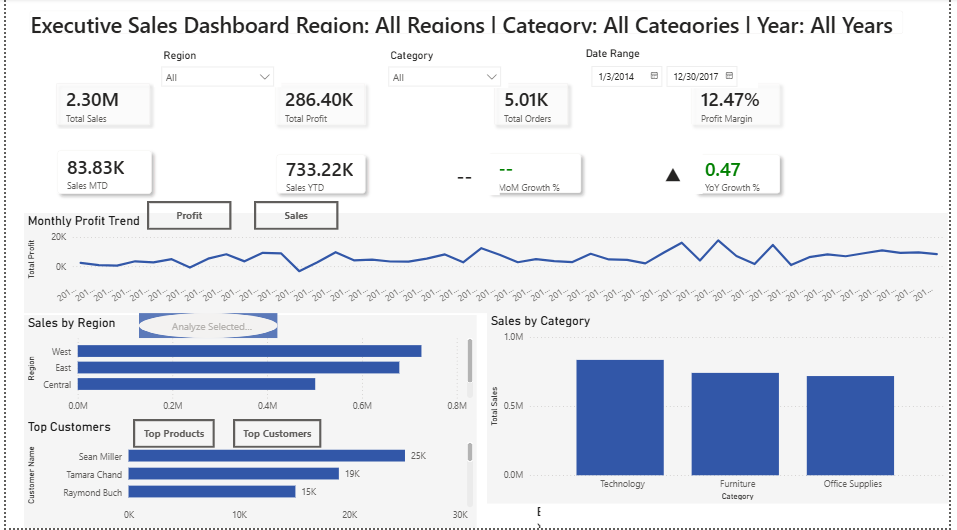
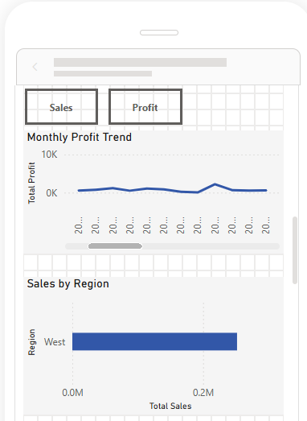
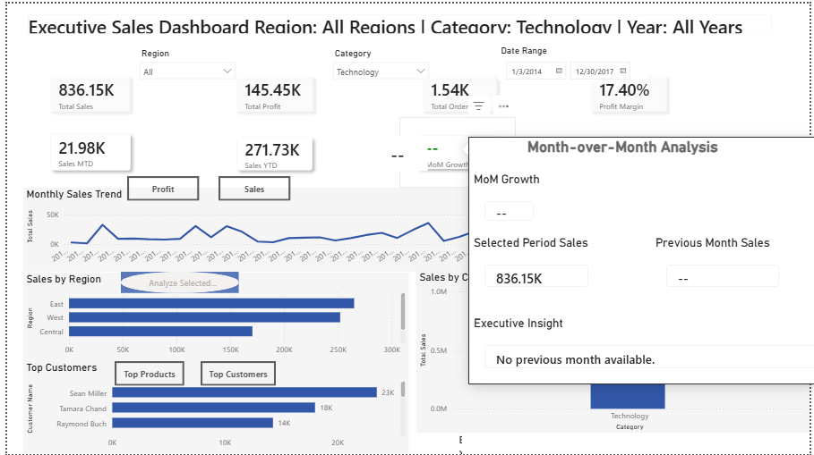
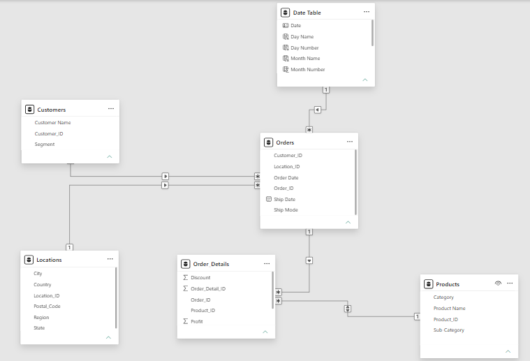

# 📊 Executive Sales Dashboard

> **An interactive Microsoft Power BI dashboard designed to transform transactional sales data into executive-level business insights through advanced analytics, dynamic reporting, and intuitive visualizations. **

---

## 📌 Project Overview

The **Executive Sales Dashboard** is a comprehensive Business Intelligence solution developed using **Microsoft Power BI** to analyze the Sample Superstore dataset.

The dashboard enables business stakeholders to monitor key performance indicators (KPIs), evaluate profitability, analyze regional and product performance, and identify business trends using interactive visualizations and advanced DAX calculations.

This project demonstrates an end-to-end Power BI workflow, from data preparation and modeling to dashboard design and executive reporting.

---

## 🎯 Business Problem

Organizations generate large volumes of transactional sales data but often lack an efficient way to transform that data into actionable business insights.

Business leaders require a centralized reporting solution that provides:

- Revenue monitoring
- Profitability analysis
- Regional performance comparisons
- Product category analysis
- Time-based trend analysis
- Interactive exploration of business performance

This dashboard addresses those challenges through a modern, executive-focused reporting experience.

---

# 🖥 Dashboard Preview

The main executive dashboard provides a high-level overview of sales performance, profitability, regional trends, and product category analysis through interactive KPIs and visualizations.

<p align="center">
  
</p>

---

# 📱 Mobile Dashboard



The report includes a dedicated mobile layout optimized for smartphones to ensure executives can monitor business performance on the go.

---

# 🔍 Drill-through Analysis


Drill-through pages allow users to navigate from summary metrics into detailed regional and category analysis for deeper business investigation.

---

# 💡 Report Page Tooltips



Interactive report tooltips provide additional context without cluttering the main dashboard.

---

# 🗂 Data Model



The dashboard is built using a Star Schema model that improves performance, simplifies DAX calculations, and supports scalable reporting.

---

# 📈 Dashboard Features

- Executive KPI Cards
- Sales Trend Analysis
- Regional Performance Analysis
- Product Category Analysis
- Dynamic Dashboard Titles
- Dynamic KPI Indicators
- Drill-through Navigation
- Report Page Tooltips
- Interactive Slicers
- Bookmarks
- Buttons
- Conditional Formatting
- Mobile Layout
- Performance Optimization

---

# 🧮 Advanced DAX Features

This project demonstrates practical implementation of:

- Time Intelligence
  - Month-to-Date (MTD)
  - Year-to-Date (YTD)
  - Previous Month
  - Previous Year
  - Month-over-Month Growth
  - Year-over-Year Growth

- Dynamic Dashboard Titles

- Executive Insight Measures

- KPI Indicator Measures

- Conditional Formatting Measures

- Dynamic Selection Summaries

---

# 🛠 Technologies Used

| Technology | Purpose |
|------------|---------|
| Microsoft Power BI | Dashboard Development |
| Power Query | Data Cleaning & Transformation |
| DAX | Business Calculations |
| Data Modeling | Star Schema |
| Microsoft Excel / CSV | Dataset |
| Git & GitHub | Version Control & Portfolio |

---

# 📁 Repository Structure

```text
Executive-Sales-Dashboard/
│
├── Dashboard/
│   └── Executive Sales Dashboard.pbix
│
├── Data/
│   └── Sample-Superstore.csv
│
├── Images/
│   ├── Dashboard Overview.png
│   ├── Mobile Dashboard.png
│   ├── Drill-through.png
│   ├── Tooltip.png
│   └── Data Model.png
│
├── Documentation/
│   ├── 01_Project_Summary.pdf
│   ├── 02_Business_Insights.pdf
│   └── 03_DAX_Measures.pdf
│
└── README.md
```

---

# 📚 Documentation

The repository includes supporting documentation:

- Project Summary
- Business Insights Report
- DAX Measures Documentation

---

# 📊 Key Business Insights

Key findings from the analysis include:

- The West Region generated the highest sales and overall profitability.
- Technology products delivered the strongest profit performance.
- Furniture generated strong sales but lower profit margins, indicating opportunities for pricing and discount optimization.
- Time Intelligence measures enabled Month-over-Month and Year-over-Year performance comparisons.
- Interactive dashboard features improved executive decision-making by providing dynamic and contextual business insights.

---

# 💼 Skills Demonstrated

### Data Preparation

- Data Cleaning
- Power Query
- Data Transformation

### Data Modeling

- Star Schema
- Relationships
- Date Table

### DAX

- Aggregation Measures
- Time Intelligence
- Dynamic Titles
- KPI Indicators
- Executive Insight Measures
- Conditional Formatting

### Reporting

- Executive Dashboard Design
- Drill-through
- Report Tooltips
- Interactive Slicers
- Bookmarks
- Mobile Layout

### Performance Optimization

- Performance Analyzer
- Auto Date/Time Optimization
- Report Optimization

---

# 🚀 Future Improvements

Potential future enhancements include:

- Row-Level Security (RLS)
- Sales Forecasting
- Incremental Data Refresh
- Power BI Service Alerts
- AI Visuals
- Real-Time Data Integration

---

# 👨‍💻 About the Author

**OCHIENG' FELIX OTIENO**

Bachelor of Information Technology

Aspiring Data Analyst | Power BI Developer | Data Science Enthusiast

---

# 📬 Contact

- GitHub: https://github.com/OCHIENG-FELIX
- LinkedIn: *(Add your LinkedIn profile)*
- Email: *(Add your professional email)*

---

## ⭐ If you found this project interesting, consider giving it a star!
